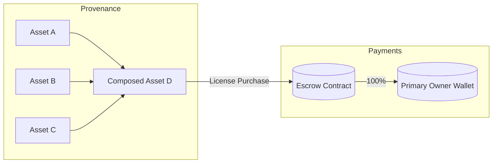
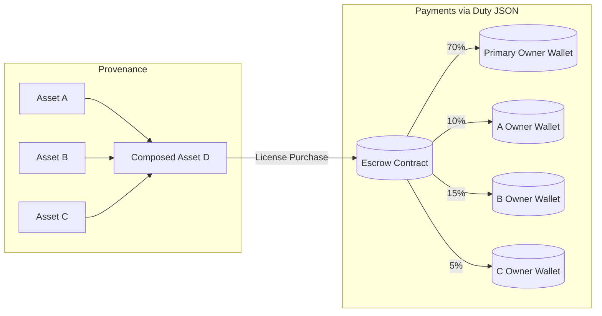

# decade-dae-demonstrator
DECADE demonstrator showcasing decentralised asset licensing with C2PA provenance, ODRL policies, smart contracts, and blockchain-anchored proof of publishing.
# Decade – Decentralised Content Management

Decade is a decentralised platform for C2PA-compliant asset provenance, ODRL-based licensing, and automated escrow payments with royalty splits. It currently focuses on images and is designed to extend to other media types.

## Key Features
- C2PA manifest generation, storage, and verification (soft binding supported)
- ODRL policy creation per action with constraints and duties
- Automated escrow payments with royalty distribution and platform fees
- Royalty composition for derived works (provenance-aware upstream splits)
- Watermark registry and manifest resolution (two‑stage design)
- Dashboards for marketplace, escrow, and documentation

## Docs & Diagrams
- System Wiki (Mermaid diagrams, flows): visit the app at `/wiki`
- Includes “Provenance → Payments” diagrams for:
  - Single-owner payout (100% to owner)
  - Multi-split via duty JSON (e.g., 70% owner; 10%/15%/5% to upstream owners)

### Provenance → Payments

Single Owner Payout



Multi‑Split via Duty JSON



## Quick Start (Docker)
```bash
docker-compose up --build
```
Then open the app in your browser (default Flask host/port) and navigate to:
- `/wiki` – diagrams and system documentation
- `/marketplace` – browse assets and purchase licenses
- `/escrow` – escrow dashboard

## Components (High Level)
- Smart contracts: Asset Registry, License Manager, Escrow Manager, Watermark Registry
- Python/Flask backend providing APIs and UI
- Client-side dashboards for composing royalties, purchasing, and viewing escrow

## Notes
- This repository includes example manifests, images, and test utilities for local development.
- Replace environment variables and contract addresses according to your deployment.
